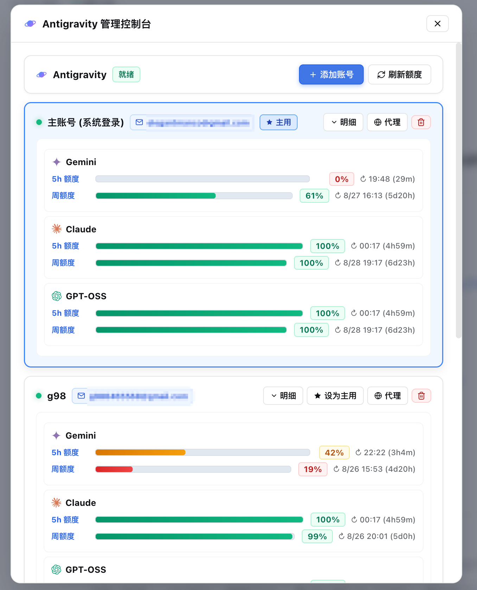
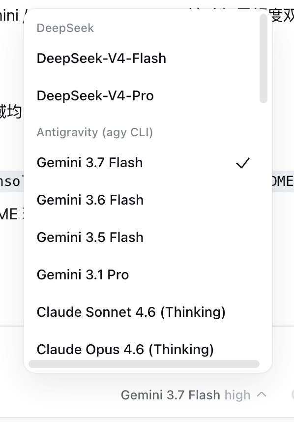

<h1 align="center">🛰️ dsh-cloudcode-link</h1>

<p align="center">
  <b>DeepSeek Harness × Google Cloud Code PA API</b> — Direct Streaming, Multi-Account Pool & Smart Routing / 基于 Cloud Code PA API 的原生纯直连 DSH 插件
</p>

<p align="center">
  <a href="https://www.npmjs.com/package/dsh-cloudcode-link"></a>
  
  
</p>

<p align="center">
  <b>🌐 Language / 语言：</b>
  <a href="#中文">中文</a> ·
  <a href="#english">English</a>
</p>

---

# 中文

**dsh-cloudcode-link** 是为 DeepSeek Harness（DSH）打造的全新 **Google Cloud Code PA API 原生驱动插件**。无需在本地安装或依赖 `agy` CLI 二进制程序，通过直接与 Google Cloud Code 内部 API 端点通信，实现超低延迟流式响应、思考链折叠（thinking）、原生工具调用（tool calls）、多账号池化与顺序耗尽故障转移。

<p align="center">
  
  &nbsp;&nbsp;
  
</p>

---

> 🚨 **【网络前置要求：必须开启系统代理 / TUN 模式】**
>
> Google Cloud Code PA 服务及 OAuth 登录需要直连 Google 官方服务器（`oauth2.googleapis.com`、`cloudcode-pa.googleapis.com` 等）。
>
> 1. **推荐方式**：开启代理工具（Clash / Surge / v2rayA / Sing-box / Loon 等）的 **TUN 虚拟网卡模式**，确保终端与后台 Node.js 进程网络畅通。
> 2. **GUI 账号独立代理**：进入 DSH「设置 → Antigravity / Cloud Code」管理面板，可为每个账号单独绑定专属 HTTP(S) / SOCKS 代理，实现多账号不同 IP 出口隔离。

---

## 🌟 核心亮点

- 🚀 **纯 API 直连 (Direct Cloud Code PA Streaming)**：摆脱对外部 CLI 进程（如 `agy`）的 `spawn` 依赖，以原生 HTTP/2 与 SSE 协议直接流式通信，首包延迟大幅降低。
- 👥 **多账号智能池化管理 (Account Pool)**：在 DSH 内添加任意数量的 Google 账号（主账号 + 备用账号群），每个账号拥有独立的凭证隔离与状态机管理。
- 🔄 **顺序耗尽故障转移 (Sequential Drain)**：当前账号额度用尽（触发 429 限流或 5h / 周额度耗尽）时，系统**自动平滑接力至下一个可用账号**，对话完全不中断！
- 💓 **子代理保活心跳 (Session Keepalive Heartbeat)**：在长流程 Subagent 任务执行期间，按配置周期向活跃账号发送轻量心跳探针，防止 Google Cloud Code 会话 KV 缓存过期被回收。
- 🛡️ **完整思考链与工具调用支持 (Thought Signatures & Tool Calls)**：原生保留 Gemini 2.5 / 3.0 的 `thoughtSignature` 校验凭据，多轮复杂工具链调用与结构化推理稳定不丢上下文。
- 📊 **官方双 Bucket 配额监控 (Dual-Bucket Quota)**：直接调用官方专用的配额摘要接口，实时呈现 **5小时滚动额度** 与 **7天周额度** 真实数据及精准重置倒计时。
- 🔑 **GUI 内浏览器免粘贴登录 (In-GUI Zero-Paste OAuth)**：点击「➕ 添加账号」自动调起系统浏览器，本地回环监听自动捕获授权凭证，无需手动复制粘贴授权码。

---

## 📦 安装与配置

### 1. 安装插件

在 DSH 安装目录或配置文件中执行：

```bash
dsh plugin --profile web add dsh-cloudcode-link
```

### 2. 环境变量配置（可选）

| 环境变量 | 默认值 | 说明 |
| -------- | ------ | ---- |
| `DSH_CLOUDCODE_ENABLED` | `true` | 是否启用插件 |
| `DSH_CLOUDCODE_DEFAULT_MODEL` | `gemini-2.5-pro` | 默认首选模型 |
| `DSH_CLOUDCODE_DEFAULT_EFFORT` | `high` | 默认思考强度（high / medium / low） |
| `DSH_CLOUDCODE_HEARTBEAT_ENABLED` | `true` | 是否启用子代理保活心跳 |
| `DSH_CLOUDCODE_HEARTBEAT_INTERVAL_MS` | `180000` | 心跳间隔毫秒数（最小 30000ms） |
| `ANTIGRAVITY_BASE_URL` | *(Google 官方端点)* | 自定义 Cloud Code PA API 端点 |

---

# English

**dsh-cloudcode-link** is a high-performance **Google Cloud Code PA API provider plugin** for DeepSeek Harness (DSH). It establishes direct HTTP/2 SSE streaming connections with Google's Cloud Code PA service, completely removing the dependency on external CLI binaries like `agy`.

## Key Features

- 🚀 **Direct API Streaming**: Pure SSE streaming with zero child-process spawn overhead.
- 👥 **Account Pool & Sequential Drain**: Multi-account management with auto failover on 429 rate limit or quota exhaustion.
- 💓 **Keepalive Heartbeat**: Background ping mechanism during subagent execution to preserve remote session KV cache.
- 🛡️ **Full Thought Signature Support**: Preserves cryptographic reasoning signatures across multi-turn tool calling sequences.
- 📊 **Dual-Bucket Quota Tracking**: Real-time 5-hour rolling and 7-day weekly quota inspection with countdown timers.
- 🔑 **Zero-Paste Browser OAuth**: Built-in PKCE loopback authentication flow.

## License

MIT © [WinterSold1er](https://github.com/WinterSold1er)
